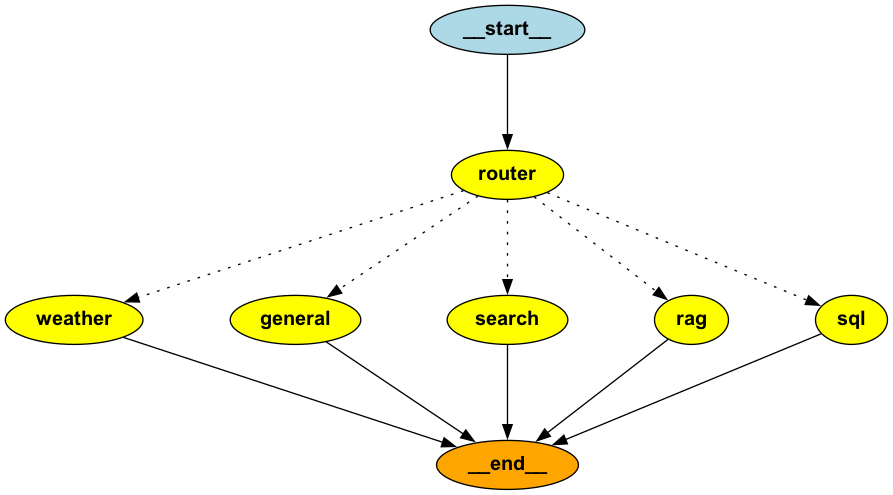

# Multi-Tool Agentic AI — Solar / Renewable Energy Equipment Assistant

A LangGraph agent for a solar/PV equipment business, routing each message
to one of five specialized nodes — **weather** (solar production
relevance), **web search**, **RAG retrieval** (Greek RES regulations),
**Text-to-SQL** (equipment sales), or a **general** LLM fallback — with
conversation memory that persists across restarts. The agent answers in
whichever language it's asked - Greek or English.

**Scope of this submission:** of the 5 features described in the
assignment, this submission implements **Feature 1 (Web Search Agent)**,
**Feature 2 (RAG Retrieval Agent)**, and **Feature 3 (Text-to-SQL Agent)**,
on top of the given baseline (Weather tool + general LLM node). **Feature
4 (Intent Router)** and **Feature 5 (Conversation Memory & Persistence)**
are also implemented, since the assignment describes them as connective
infrastructure that applies across all paths regardless of how many of
the independent agents are built.
___


___
## 1. System Overview

| Node | File | What it does |
|---|---|---|
| **router** | `src/router.py` | Single temperature=0 LLM call classifies the message into `weather`/`search`/`rag`/`sql`/`general` using a few-shot prompt. Falls back to `general` on ambiguous/unparseable output. |
| **weather** *(baseline, reframed)* | `src/agents/weather_agent.py` | Looks up weather via Open-Meteo, including **cloud cover and sunshine duration** - the figures that actually matter for estimating solar production, not just "is it raining". Includes a small Greek→English city-name lookup, since the geocoding API doesn't match Greek-script names. |
| **search** *(Feature 1)* | `src/agents/search_agent.py` | Tavily search for time-sensitive info the RAG knowledge base can't have: current energy prices, new subsidy announcements, market news. Inline `[1][2]` citations; graceful fallback when nothing relevant is found. |
| **rag** *(Feature 2)* | `src/agents/rag_agent.py` | Retrieves from a persisted ChromaDB collection of real Greek RES regulatory documents and answers strictly from those chunks, citing the source per claim. |
| **sql** *(Feature 3)* | `src/agents/sql_agent.py` | Generates a SQLite `SELECT` query against the solar-equipment sales database, validates it's read-only, executes it, explains the result. |
| **general** *(baseline)* | `src/agents/general_agent.py` | Catch-all LLM node for anything else, with the same rolling conversation history as every other node. |

**Language behavior:** every agent's system prompt instructs it to answer
in the same language the question was asked in (Greek → Greek, English →
English). Hardcoded fallback messages (empty search results, blocked SQL,
no RAG matches) also have Greek/English variants picked via a small
`src/lang_detect.py` helper, so even paths that skip the LLM call entirely
still respond in the right language.

Every node reads/writes the same `AgentState` (`src/state.py`), and every
node receives the same `history` field (Feature 5) so conversational
references work no matter which node ends up handling the current turn.
___
## 2. Setup Instructions

1. Clone and enter the repo, then create a virtual environment
```bash
python3 -m venv venv
source venv/bin/activate        

pip3 install -r requirements.txt

cp .env.example .env
# Edit .env and set:
#   GROQ_API_KEY=...    (required - free tier at console.groq.com)
#   TAVILY_API_KEY=...  (required for the search node - free key at tavily.com)
# (No key needed for weather - it uses the free Open-Meteo API.)

python3 scripts/build_database.py
python3 scripts/visualize_graph.py
```

___
## 3. How to Run

```bash
python3 main.py

# Resume an existing conversation later
python3 main.py --conversation-id <id-printed-at-startup>
```

Type `exit` or `quit` to end the session. The conversation id is printed
when a new session starts. Ask in Greek or English - the agent matches
your language.

### Example interaction (live run, all 5 routes - in Greek)

> **You:** Τι καιρό θα κάνει στην Αθήνα σήμερα;
>
> **Agent:** Σήμερα στην Αθήνα ο καιρός είναι ηλιόλουστος με τρέχουσα θερμοκρασία 24,1 °C και ελάχιστο αεράκι 5,3 km/h. Ο ουρανός είναι καθαρός, χωρίς σύννεφα (0 % cloud cover), και η θερμοκρασία θα κυμανθεί από 23,1 °C έως 31,5 °C. Η διάρκεια ηλιοφάνειας είναι περίπου 14,1 ώρες, κάτι που σημαίνει εξαιρετικές συνθήκες για την παραγωγή ηλιακής ενέργειας σήμερα.

> **You:** Τι είναι το net-metering;
>
> **Agent:** Το **net‑metering** (ή «ενεργειακός συμψηφισμός») είναι το σύστημα κατά το οποίο η παραγόμενη από έναν μικρο‑παραγωγό (π.χ. φωτοβολταϊκό σύστημα) ηλεκτρική ενέργεια «συμψηφίζεται» με την ενέργεια που καταναλώνεται από τον ίδιο χρήστη, μειώνοντας έτσι το ποσό που πρέπει να πληρώσει στο δίκτυο. Στην Ελλάδα το καθεστώς αυτό θεσπίστηκε αρχικά με το ν. 3468/2006 (άρθρο 14Α) και αργότερα ενσωματώθηκε και σε άλλες νομοθετικές πράξεις [2].
>
> Πηγές / Sources:
> [1] net_metering_and_billing.md (chunk 5)
> [2] net_metering_and_billing.md (chunk 0)
> [3] net_metering_and_billing.md (chunk 1)
> [4] pv_licensing_and_connection.pdf (chunk 4)

> **You:** Ποια κατηγορία προϊόντων είχε τα μεγαλύτερα έσοδα;
>
> **Agent:** Η κατηγορία προϊόντων που είχε τα μεγαλύτερα έσοδα είναι η «Μπαταρία».
>
> (SQL used: SELECT p.category FROM sales s JOIN products p ON s.product_id = p.product_id GROUP BY p.category ORDER BY SUM(s.total_amount) DESC LIMIT 1)

> **You:** Ποιες είναι οι τρέχουσες τιμές ενέργειας στην Ελλάδα;
>
> **Agent:** Οι τρέχουσες τιμές ηλεκτρικής ενέργειας στην Ελλάδα είναι:
>
> * **Δεύτερο εξάμηνο 2024** – η καθαρή τιμή ηλεκτρικού ρεύματος ήταν **0,192 €/kWh** [2].
> * **Δεύτερο εξάμηνο 2025** – η καθαρή τιμή ηλεκτρικού ρεύματος ανήλθε σε **0,195 €/kWh** [2].
>
> Αυτές οι τιμές είναι ελαφρώς χαμηλότερες από τον μέσο όρο της Ευρωπαϊκής Ένωσης, ο οποίος ήταν **0,22 €/kWh** το 2024 και **0,205 €/kWh** το 2025 [2].
>
> Πηγές / Sources:
> [1] Ινστιτούτο Αλέξη Τσίπρα: Η Ελλάδα 4η ακριβότερη στην Ε.Ε σε κόστη ενέργειας και προμήθειας - https://in-at.gr/institouto-alexi-tsipra-i-ellada-4i-akrivoteri-stin-e-e-se-kosti-energeias-kai-promitheias
> [2] Τιμή ηλεκτρικού ρεύματος στην Ελλάδα | Greece in Figures - https://www.greeceinfigures.com/timi-ilektrikou-reumatos-noikokiria
> [3] Το ενεργειακό τοπίο στην Ελλάδα: Τάσεις και εξελίξεις στις τιμές - https://www.ertnews.gr/eidiseis/oikonomia/to-energeiako-topio-stin-ellada-taseis-kai-ekselikseis-stis-times-kaysimon-kai-ilektrikou-reymatos-ti-anamenetai-gia-ton-maio
> [4] ΕΛΙΑΜΕΠ | In focus – Οι τιμές ηλεκτρικού ρεύματος στην Ελλάδα και στην ΕΕ - https://www.eliamep.gr/in-focus-oi-times-ilektrikou-revmatos-stin-ellada-kai-stin-ee
> [5] Τιμές και Χρεώσεις - ΡΑΑΕΥ Ενέργεια

> **You:** Τι είναι το LangGraph;
>
> **Agent:** **LangGraph** είναι μια ανοιχτού κώδικα βιβλιοθήκη (Python) που βοηθά στην κατασκευή εφαρμογών που χρησιμοποιούν μεγάλα γλωσσικά μοντέλα (LLM) με βάση **γραφικές (graph) δομές**.
>
> - **Γραφήματα ροής**: Τα βήματα μιας αλληλεπίδρασης (π.χ. ερωτήσεις, επεξεργασία, λήψη αποφάσεων, κλήση εξωτερικών API) αναπαρίστανται ως κόμβοι και ακμές, επιτρέποντας την οπτική και προγραμματική διαχείριση της λογικής.
> - **Κατάσταση & μνήμη**: Κάθε κόμβος μπορεί να διατηρεί κατάσταση (state) ή μνήμη, ώστε το σύστημα να «θυμάται» προηγούμενα βήματα.
> - **Ευελιξία**: Συνδυάζει LLMs με άλλες λειτουργίες (π.χ. βάσεις δεδομένων, εργαλεία, εξωτερικές υπηρεσίες) χωρίς να χρειάζεται να γράψετε πολύπλοκο κώδικα ελέγχου.
> - **Συμβατότητα**: Ενσωματώνεται εύκολα με δημοφιλή πλαίσια όπως LangChain, OpenAI, Anthropic κ.ά., και υποστηρίζει εκτέλεση σε τοπικό ή cloud περιβάλλον.
>
> Με απλά λόγια, το LangGraph σας δίνει ένα «πλαίσιο» για να σχεδιάσετε, να εκτελέσετε και να διαχειριστείτε πολύπλοκες αλληλεπιδράσεις LLM ως διαδραστικά, επαναχρησιμοποιήσιμα και επεκτάσιμα γραφήματα.

## 4. Knowledge Base (Feature 2)

**Domain:** Greek regulations for solar/PV systems. Five documents in
`data/knowledge_base/`, each citing its real source at the top:

| File | Source |
|---|---|
| `net_metering_and_billing.md` | Law 3468/2006 Article 14A, Law 4203/2013 (Government Gazette 235Α), Law 4414/2016 (Government Gazette 149Α), Law 5037/2023 (Government Gazette 78Α — transition to net-billing), RAAEY (Greek energy regulator) decision E-192/2025 |
| `subsidy_program_pv_stegi.md` | ΥΠΕΝ/ΥΔΕΝ/47129/720/28.4.2023 (Government Gazette Β' 2903), ΥΠΕΝ/ΔΑΠΕΕΚ/1004/36/2025 (Government Gazette Β' 17) — the "Φωτοβολταϊκά στη Στέγη" (Rooftop Solar) subsidy program, run by the Greek Ministry of Environment and Energy (ΥΠΕΝ) |
| `vat_tax_treatment.md` | Current 24% VAT rate, EU Directive 2022/542, HELAPCO's (Hellenic Association of Photovoltaic Companies) request to the Ministry of Finance (helapco.gr) |
| `energy_communities.md` | Law 4513/2018 (Government Gazette 9Α), Ministerial Decision ΥΠΕΝ/ΔΑΠΕΕΚ/15084/382 (Government Gazette Β' 759/2019) |
| `pv_licensing_and_connection.pdf` | Law 3851/2010 (license exemption for systems <1MWp), Law 4685/2020 (Government Gazette 92Α — Producer Certificate), official ΔΕΔΔΗΕ (Hellenic Electricity Distribution Network Operator) grid connection procedure |                       |

Chunked at 800 characters with 150-character overlap, embedded with the
multilingual `sentence-transformers/paraphrase-multilingual-MiniLM-L12-v2`,
and stored in a ChromaDB collection persisted to `chroma_db/` (built once
via `scripts/ingest_kb.py`, never re-embedded on app startup).

## 5. Database (Feature 3)

**Domain:** solar/PV equipment sales. This is synthetic sample data,
not a real company's sales records.

Two related tables in `data/database.db` (schema in `data/schema.sql`,
seed script in `scripts/build_database.py`):

- `products` (20 rows) — panels, inverters, batteries, accessories, with realistic Greek-market pricing
- `sales` (180 rows) — sale_id, product_id → products.product_id, sale_date, quantity, **region** (Κρήτη/Αττική/Πελοπόννησος/Θεσσαλία/Κεντρική Μακεδονία — regions chosen for their differing solar irradiance, tying back to the weather node), total_amount

### Safety

The validation stage in `src/tools/sql_tool.py` rejects any query
containing `DROP`, `DELETE`, `UPDATE`, `INSERT`, `ALTER`, or `TRUNCATE` as
a whole word, rejects anything not starting with `SELECT`/`WITH`, and
rejects stacked statements (`;`). As defense in depth, the DB connection
itself is opened read-only (`mode=ro`), so even a validation bypass can't
write.

## 6. Router Test Cases (Feature 4)

Ran against the live Groq API (`openai/gpt-oss-120b`) via
`python3 scripts/test_router.py`:

| # | Input Message | Expected Route | Actual Route | Match |
|---|---|---|---|---|
| 1 | What is the weather in Athens tomorrow? | weather | weather | ✅ |
| 2 | Θα έχει ηλιοφάνεια στην Κρήτη αυτή την εβδομάδα; | weather | weather | ✅ |
| 3 | What's the cloud cover forecast for Thessaloniki? | weather | weather | ✅ |
| 4 | What are current electricity prices in Greece? | search | search | ✅ |
| 5 | Υπάρχουν νέα προγράμματα επιδότησης φωτοβολταϊκών αυτή την περίοδο; | search | search | ✅ |
| 6 | Any recent news on PV equipment prices? | search | search | ✅ |
| 7 | What is net-metering and how does it work? | rag | rag | ✅ |
| 8 | Ποια είναι τα όρια ισχύος για αυτοπαραγωγούς; | rag | rag | ✅ |
| 9 | How do I get a Φωτοβολταϊκά στη Στέγη subsidy? | rag | rag | ✅ |
| 10 | What's the VAT rate on solar panels in Greece? | rag | rag | ✅ |
| 11 | What were total sales last month? | sql | sql | ✅ |
| 12 | Ποια κατηγορία προϊόντων είχε τα μεγαλύτερα έσοδα; | sql | sql | ✅ |
| 13 | How many 10kWh batteries have we sold? | sql | sql | ✅ |
| 14 | Explain what LangGraph is. | general | general | ✅ |

**Accuracy: 14/14 (100%)**

## 7. Conversation Memory & Persistence (Feature 5)

Tested live against the running app (5a) and across a full server restart (5b).

### 5a — In-session memory

| Turn | Message | Response |
|---|---|---|
| 1 | "My favourite city is Athens." | "That's a great choice! Athens has a wonderful blend of history, culture..." |
| 2 | "What city did I tell you I like?" | **"You mentioned that your favorite city is Athens."** |

Matches the assignment's expected behaviour exactly (Turn 1 → acknowledge, Turn 2 → correctly recall the city from history).

### 5b — Database persistence across restarts

Using the same `conversation_id` from the test above, the server was fully
stopped (`Ctrl+C`) and restarted (`uvicorn api:app --reload`) before
sending a third message:

| Turn | Message | Response |
|---|---|---|
| 3 (after restart) | "What did I just ask about?" | **"You asked which city you had told me you like."** |

The agent still remembered the conversation after a full process restart,
confirming history is read from `data/conversations.db` (SQLite), not
just held in RAM.

## 8. REST API (Optional Extra)

Beyond the required CLI (`main.py`), the same graph is also exposed as a
small REST API (`api.py`), built with FastAPI.

```bash
pip3 install fastapi uvicorn
uvicorn api:app --reload
```

Interactive docs (Swagger UI): `http://127.0.0.1:8000/docs`

| Method | Path | Description |
|---|---|---|
| `GET` | `/health` | Basic health check |
| `POST` | `/chat` | Send a message; same memory workflow as `main.py`. Body: `{"message": str, "conversation_id": str or null}`. Response: `{"response": str, "conversation_id": str, "route": str}` |
| `GET` | `/conversations/{conversation_id}/history` | Returns the full stored message history for a conversation |

Example:
```bash
curl -X POST http://127.0.0.1:8000/chat \
  -H "Content-Type: application/json" \
  -d '{"message": "Τι καιρό θα κάνει στην Αθήνα;", "conversation_id": null}'
```

## 9. Project Structure

```
agentic-homework/
├── main.py                      # Entry point: conversational loop + memory wiring
├── api.py                       # Optional REST API (FastAPI) wrapping the same graph
├── src/
│   ├── state.py                 # Shared AgentState schema
│   ├── llm.py                   # Groq client wrapper
│   ├── lang_detect.py           # Greek/English detection for hardcoded fallbacks
│   ├── router.py                # Feature 4: intent classifier
│   ├── memory.py                # Feature 5: all DB reads/writes live here
│   ├── graph.py                 # LangGraph wiring: nodes + conditional edges
│   ├── agents/
│   │   ├── weather_agent.py     # baseline, reframed for solar production
│   │   ├── search_agent.py      # Feature 1
│   │   ├── rag_agent.py         # Feature 2
│   │   ├── sql_agent.py         # Feature 3
│   │   └── general_agent.py     # baseline
│   └── tools/
│       ├── weather.py           # baseline (+ cloud cover / sunshine + Greek city aliases)
│       ├── search.py            # Feature 1: Tavily wrapper
│       ├── rag.py               # Feature 2: chunking + ChromaDB
│       └── sql_tool.py          # Feature 3: validation + execution
├── scripts/
│   ├── build_database.py        # Builds data/database.db (Feature 3)
│   ├── ingest_kb.py             # Builds chroma_db/ (Feature 2)
│   ├── visualize_graph.py       # Generates results/graph.png (Feature 4)
│   ├── test_router.py           # Generates the table in section 6 (Feature 4)
│   └── _generate_licensing_pdf.py  # Authoring script for the PDF (not runtime)
├── data/
│   ├── knowledge_base/          # RAG source documents (Feature 2)
│   ├── schema.sql                # SQL creation script (Feature 3)
│   ├── database.db               # Seeded solar-equipment sales DB (Feature 3)
│   └── conversations.db          # Conversation history (created on first run, Feature 5)
├── chroma_db/                    # Persisted ChromaDB vector store (Feature 2)
├── results/
│   └── graph.png                 # Required graph visualization (Feature 4)
├── requirements.txt
├── .env.example
└── README.md
```